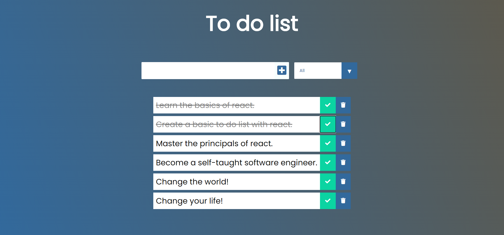
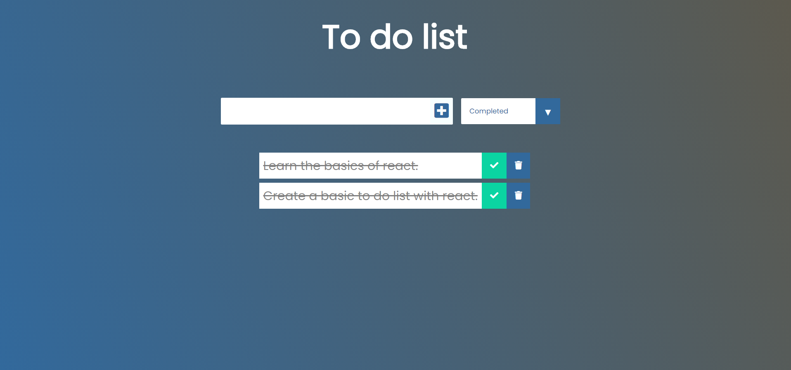
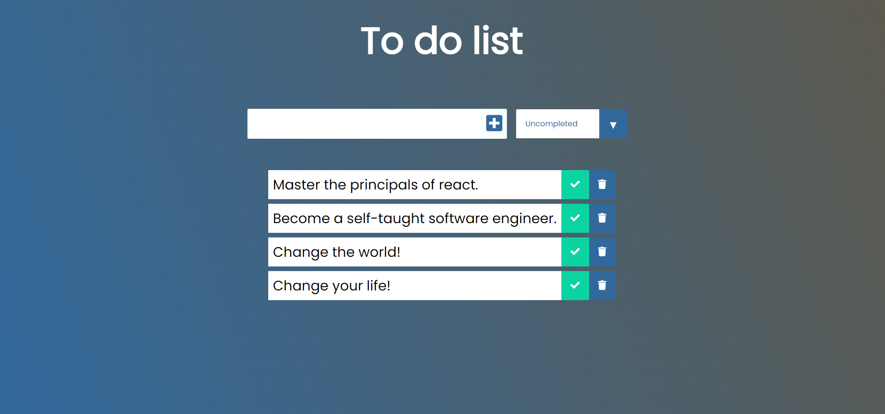

This project was bootstrapped with [Create React App](https://github.com/facebook/create-react-app).

In the project directory, you can run:

### `npm start`

Runs the app in the development mode. 
Open [http://localhost:3000](http://localhost:3000) to view it in the browser.

The page will reload if you make edits. 
You will also see any lint errors in the console.

This basic react app allows you to create a to do list and makes use of localstorage to save the data. It has the functionality to allow you to toggle between all todo's, completed and uncompleted. By clicking on the checkmark('completed') it draws a line through the text and filters it to completed and trash button of course deletes it from the list.

